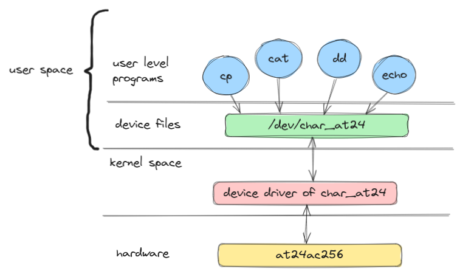
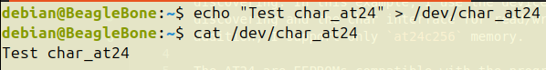

# Simple Linux character device driver for at24 i2c memory

The projects aims to practice how to interface a real hardware with the driver model of the Linux kernel. The idea here is to provide a `char` device under `/dev/char_at24`. There exists a mainline at24 driver in `drivers/misc/eeprom/at24.c` which in certains aspects I took as reference. However, this differ in the sense that the other one uses the `nvmem` subsystem as interface for the mememory, apart that it uses the `acpi` for discovering. In this example, I use the device tree for discovering and the char interface for read/write ops. In addition, I support only `at24c256` memory.

The AT24 are EEPROMs compatible with the programming model of Atmel AT24.

  

  

**This is not a production driver**
